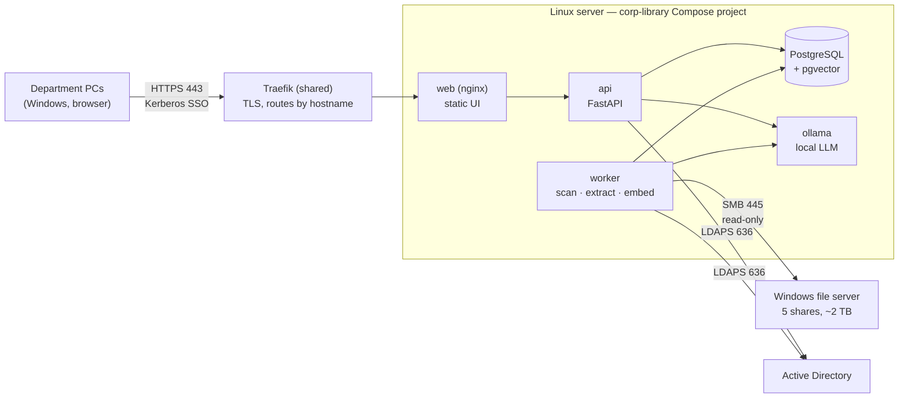

# Corp Library — Roadmap

_Last updated: 2026-10-08 (phase 2 implemented and audited; phase 1 waiting on IT for SSO and real-user verification)_

Corp Library is an internal web app that helps our department (~15 people) find documents on the
department shares and decide where new documents belong. It indexes the 5 top-level shares on the
Windows file server (~2 TB), shows each user only what Windows already lets them open, and adds a
local AI assistant that never sends data outside the network.

IT requirements and their justification live in a separate shareable doc:
**Corp Library — IT Requirements** (link it here once shared with IT).

---

## Decisions so far

| Topic | Decision | Why |
| --- | --- | --- |
| Hosting | Docker Compose on the department Linux server | Same as our other webapps; auto-start, easy redeploys |
| Backend | Python + FastAPI | Best ecosystem for text extraction, embeddings and local LLMs |
| Frontend | React + Vite + Tailwind (from v0.1) | Already scaffolded |
| Database | PostgreSQL + pgvector | Concurrency, full-text search and vector search in one place |
| Sign-in | Kerberos SSO, with an LDAP login form as fallback | People won't use an app that asks for a password every day |
| Permissions | Mirror the real NTFS ACLs from the file server, matched by SID | Windows stays the single source of truth; nothing to maintain twice |
| File access | **Read-only.** The app advises; users save files themselves | Safest scope and easiest for IT to approve |
| AI | Local only: Ollama + an open model (Qwen class), `bge-m3` embeddings | Documents contain personal data; English and Spanish both supported |
| GPU | Not guaranteed. Everything except the assistant must work well on CPU | Search delivers most of the daily value |
| HTTPS & hostnames | Shared **Traefik** reverse proxy (separate `traefik-proxy` project) on 443; one hostname per app via DNS **A records**; internal-CA certificate, ideally wildcard | Several apps share the server; Kerberos needs a distinct hostname per app; TLS managed in one place |
| CI/CD | GitHub Actions: tests (SQLite + PostgreSQL), frontend build, then images pushed to ghcr.io tagged `latest` + `sha-<commit>` (publishing switched on with the `PUBLISH_IMAGES` repo variable once the app is ready); the server only pulls | No builds on the server; every deployed image passed the tests; one-line rollback |
| Maintenance | One maintainer | Keep it to a single codebase and few containers; no microservices |

## Guiding principles

1. **Fail closed.** If we can't establish that a user may see a file, they don't see it.
2. **Filter before the AI.** Retrieval is permission-filtered before any text reaches the model.
3. **Windows is the source of truth** for permissions; the app never grants access of its own.
4. **Search must stand on its own.** The assistant is an extra and degrades gracefully without a GPU.
5. **Boring to operate.** One `docker compose up -d`, health checks, backups, logs. Nothing clever.

---

## Target architecture

| Container | Role |
| --- | --- |
| `web` | nginx: serves the built React app, proxies `/api` to FastAPI. Reached only through the shared Traefik proxy, which terminates TLS |
| `api` | FastAPI: auth, search, document streaming, assistant chat, admin |
| `worker` | Same codebase, different entrypoint: scans, text extraction, embeddings, reports. Job queue in Postgres (no broker) |
| `db` | PostgreSQL 16+ with `pgvector`; full-text search via `tsvector` (English + Spanish; accents folded by the app) |
| `ollama` | Local LLM and embedding model; optional GPU passthrough |

### How permissions work

1. The worker reads each folder's security descriptor over SMB. With 5 shares granted per user and
   inheritance, most of the work is the top-level folders, but **any subfolder that breaks inheritance
   gets its own ACL**, and the scanner flags it.
2. ACL entries are stored as SIDs (allow and deny) per folder. Each file points to its nearest folder
   with an explicit ACL.
3. At sign-in we resolve the user's SID plus all group SIDs via `tokenGroups` (nested groups included)
   and cache them in the session.
4. Every query (search, browse, assistant retrieval) joins against the ACL mirror. An empty or unknown
   ACL means **no access**.
5. Open/download streams the file through the app after re-checking access. Every access is audit-logged.

### How sign-in works

1. The browser hits `/api/auth/sso`; the API replies `401 WWW-Authenticate: Negotiate`.
2. The browser sends a Kerberos ticket (needs the SPN, keytab, intranet-zone GPO from IT).
3. The API validates it with the keytab (`gssapi`), looks up groups over LDAP, and issues an
   **HttpOnly, Secure session cookie** (sliding expiry, e.g. 30 days).
4. If SSO fails, the user sees the LDAP login form with the same result.

---

## Phases

Each phase ends with something people can use or a decision they can make.

### Phase 0 — Foundations and discovery

_Goal: a full inventory of the shares, to feed the folder-plan discussions. No end-user UI yet._

- [x] Replace SQLite with PostgreSQL; add Alembic migrations (drop `create_all`)
- [x] New Compose stack for Linux: `db`, `api`, `worker`, `web`, `backup` (+ volumes, health checks, `.env`)
- [x] SMB scanner using `smbprotocol`: walk the shares, record path, size, mtime; per-folder
      reconciliation so a transient error never wipes data
- [x] Read folder ACLs (own security-descriptor parser); resolve SIDs to users/groups via LDAP,
      expand nested groups; flag explicit ACLs, broken inheritance, unreadable ACLs
- [x] Incremental rescans (only changed files are updated); nightly schedule; Postgres job queue
- [x] Admin console + reports: inventory by share/type/age, duplicates (size → quick hash → full
      hash), stale folders, hygiene (long paths, deep and empty folders), user × folder permission
      grid, permission exceptions. All export to CSV
- [x] Backups: nightly `pg_dump` to a mounted location
- [ ] First real scan on the file server (needs the IT items below)

**Exit:** a full scan completes, and the reports have been used in a folder-plan meeting.
**Blocked by IT:** scanner account, LDAP access, firewall rules.

Notes from implementation:
- Permissions are read per **folder**. Files are assumed to inherit from their folder, which is
  the norm; reading every file's ACL would double the SMB round-trips. Revisit if the exceptions
  report suggests files with their own permissions.
- A folder's own access ("can list it") is not its files' access. Phase 1 must filter files with
  `acl.evaluate.can_read_files` (the folder's *object-inherit* ACEs), never `can_read` on the
  folder's DACL: "Read, this folder only" would otherwise expose every file in that folder.
- Folder owners are recorded; file owners are not (same cost reason).
- v0.1's catalog/search pages were removed; search is rebuilt on the new schema in phase 1.

### Phase 1 — Search MVP with SSO

_Goal: everyone uses it daily to find documents._

- [x] Kerberos SSO + LDAP fallback + HttpOnly session cookies (replace JWT in `localStorage`)
- [x] Group resolution via `tokenGroups`; SID-based permission filter on every query
- [x] Text extraction for Office/PDF/text; OCR for scanned PDFs (Tesseract, `spa+eng`).
      Other types (images, video, CAD, archives) are indexed by name, path and metadata only
- [x] Postgres full-text search: title, path, content; filters by share, type, date; highlighted snippets
- [x] Browse the share tree (permission-filtered)
- [x] Document page: metadata, preview where possible, download (re-checked), **"copy network path"**
      button (browsers block `file://` links from HTTPS pages)
- [x] Audit log of searches, opens and downloads
- [x] Shared Traefik proxy (`traefik-proxy` project) routing `APP_HOST` to the app
- [ ] Internal CA certificate installed in traefik-proxy
- [ ] SSO tested on a domain PC; permission results checked against Explorer with 3 real users
- [ ] Privacy notice (first layer on every page, full notice at `/privacy`), BUG-033: **draft in the code,
      pending expert legal review**
- [ ] Privacy notice approved by the institution: DPO review, record of processing published, ENS scope,
      DPIA assessed, staff representatives informed (checklist in `docs/PRIVACY.md`)

**Exit:** all 15 users signed in by SSO; search results match what each person can open in Explorer
(verified with at least 3 users with different access).
**Blocked by IT:** SPN + keytab, DNS A record, intranet-zone GPO, proxy bypass, certificate,
`tokenGroups` read access for the LDAP service account.

Notes from implementation:
- **Sessions** are server-side rows with a random token in an HttpOnly, Secure, SameSite=Lax cookie
  (only its hash is stored), so sign-out and account removal end them immediately. `SECRET_KEY` is gone:
  nothing is signed. CSRF: state-changing requests must carry `X-Requested-With`.
- **Groups** come from `tokenGroups` at sign-in (nested and domain-local groups included) and are
  re-read every `GROUPS_REFRESH_HOURS`. If AD is unreachable, cached groups are trusted for 3× that,
  then the user must sign in again. A disabled or deleted account loses its sessions at the next refresh.
- **Permission filter:** files are visible when their folder's *inheritable* ACEs let the user read
  (`can_read_files`, BUG-007). Browsing behaves like access-based enumeration (only listable folders).
  Admins get no extra visibility. Open/download/preview re-read the **file's own live ACL** over SMB,
  which covers files stricter than their folder and changes since the last scan. Share-level
  permissions are still not read (BUG-006).
- **Extraction** uses pdfium (PDF) and plain zip/XML parsing (Word, Excel, PowerPoint, OpenDocument),
  in the worker. No Tika/Docling container, and everything is testable on Windows. Pages without a text
  layer are OCR'd page by page. Legacy `.doc/.xls/.ppt`, `.msg` and `.rtf` are name-only for now; add
  them if the file-type question below says they matter.
- **Accents** are folded in Python before indexing and searching (the dev PostgreSQL has no `unaccent`),
  so behaviour is identical everywhere. Names and paths are split into words (`INF-2023_x.pdf` →
  `inf 2023 x pdf`) and stemmed in Spanish and English like the content.
- **Indexing** is the `index` job after each scan batch: a fast name/path pass, then content in
  20-minute rounds that requeue themselves, so the first 2 TB pass never blocks a nightly scan.
- **DEV_MODE** (BUG-017): password-less dev users with fake groups, refused unless LDAP is off and the
  database is local. `.corplib-acl.json` files fake folder permissions on local test shares.

Phase 1 audit (2026-10-08, BUG-023 to BUG-034):
- **Files with their own permissions** are now read when their text is extracted (`files.acl_id`: their
  explicit ACEs, plus the folder's inheritable ones unless inheritance is disabled). Their name, text
  and snippets follow those permissions. Files indexed by name only (no text to read) still follow
  their folder; the live check on open/download covers them.
- **Extraction runs in a child process** with a timeout and a memory limit; a file that breaks it fails
  alone. The content pass commits file by file and checks its deadline after each one.
- **Search speed** measured with `scripts/bench_search.py` (200k files, 100k readable): every query
  under 350 ms. Matches are counted up to 1,000 ("1,000+", 50 pages); beyond that, relevance ranks the
  1,000 newest name/folder matches plus the 1,000 newest matches anywhere, so a file *named* after a
  common word still comes first.
- **Privacy**: first-layer notice on every page and the sign-in page, full notice at `/privacy`
  (LOPDGDD art. 11, GDPR arts. 13–14). Reading the audit log is itself audited; accounts unused for
  `AUDIT_RETENTION_DAYS` are deleted. Nothing is loaded from other sites (fonts are bundled), and the UI
  has a strict Content-Security-Policy.

### Phase 2 — Folder plan in the app

_Goal: the agreed structure becomes data the app (and later the assistant) uses._

- [x] Folder-plan model: path, purpose, owner, what belongs/doesn't, naming convention, examples,
      keywords (EN + ES)
- [x] Admin editor + read-only "folder guide" for everyone
- [x] Compliance report: files outside the plan, naming violations, empty or overgrown folders
- [x] Track the refactor's progress over time (per share)
- [ ] The department's real plan entered in the app (needs the first real scan, then the folder-plan meetings)

**Exit:** the department's folder plan is complete in the app and used as the reference during the
refactor.
**Blocked by IT:** nothing new; the real plan needs phase 0's first real scan.

Notes from implementation:
- **Model:** one `plan_folders` row per planned folder (migration `0005`), keyed by share + path and
  matched to scanned folders by path, ignoring case as Windows does (not accents: Windows tells
  "Información" and "Informacion" apart). No foreign key to `folders`: a planned folder may not exist yet,
  and a refactor recreates real ones. A plan starts at the share's root and every entry's parent is in it,
  so it is always a tree; moving or renaming an entry moves what is planned below it.
- **Where a folder stands:** *planned* (it's an entry), *free* (an unlisted subfolder of an entry that
  allows them, e.g. one per project; it follows that entry's rules) or *outside*. Entries that only group
  others (the root, by default) can refuse files; files saved there count as outside the plan.
- **Naming rules** are a small pattern language instead of regexes, so non-developers can read them:
  `*`, `?`, `{YYYY}`, `{YY}`, `{MM}`, `{DD}`, `{N}`, checked against the name without its extension,
  ignoring case and accents. Expected file types are a separate list. The editor warns when an entry's own
  examples break its rules. Keywords are one list holding both languages.
- **Starting a plan:** "Import existing folders" (1–4 levels) creates entries from the last scan; the
  deepest level allows subfolders, so nothing below it is flagged. Then describe, prune and add.
- **Folder guide** (`/guide`, everyone): shows an entry only if the user can list its folder in Explorer
  (or, for a folder not created yet, the nearest existing one above it), like browsing. Filter box with
  accent-insensitive matching on names, purposes and keywords, a first, rule-based "where does this go?".
  Browsing a folder shows its guide, or a warning that it isn't part of the plan.
- **Compliance** is computed on request from the last scan (admin, per share, CSV export). The worker
  records its totals once a day per share in `plan_snapshots` (a `compliance` job queued after every
  scan batch, or "Record now"); the Compliance tab charts files in the plan and correctly named files over
  time. "Overgrown" = more than 500 files directly in a folder unless the entry sets its own limit.
- **Privacy:** the plan's only personal data are each folder's owner (shown to colleagues in the guide)
  and the admin who last edited an entry: work-role data, but mention it to the DPO with the rest of the
  go-live checklist. Viewing the guide is not audit-logged, so the privacy notice is unchanged.
- **Phase 3 hooks:** `services/plan.py` exposes the plan (`entries`, `place`, `guide`) and the
  keywords that `get_folder_plan` / `suggest_destination` and the no-LLM fallback will use.

Phase 2 audit (2026-10-08, BUG-035 to BUG-042):
- **Tree order:** entries are sorted by path parts, so "Contratos/2024" stays under "Contratos" and not
  under "Contratos 2024", on SQLite and PostgreSQL alike.
- **Naming patterns** are matched part by part between the stars (linear time); a pattern with many `*`
  used to take seconds per file.
- **Compliance:** each list shows its biggest problems first (folders by files, files by path), the CSV
  holds all of them, and "correctly named" counts only files under a naming pattern. Folders the scanner
  couldn't list never make a planned folder look empty or missing.
- **Browse** only shows a folder-above's guide when the user can list that folder, as the guide does.
- The progress snapshot (and indexing, dedupe) is queued even when the night's last scan fails.
- Not changed, worth knowing: plan edits are recorded only as "last changed by" (no history), and deleting
  the root entry removes a share's whole plan; the nightly `pg_dump` is the way back. Export the plan to
  CSV before big changes.

### Phase 3 — Local AI assistant

_Goal: "find me…" and "where should I save this?" answered in plain English or Spanish._

- [ ] `ollama` container; model chosen by hardware (CPU: ~4–8B quantized; GPU 16 GB: up to ~14B)
- [ ] Embeddings with `bge-m3` in the worker; chunks stored in pgvector
- [ ] Hybrid search: full-text + vectors merged with reciprocal rank fusion; also improves normal search
- [ ] Chat with a small fixed set of tools: `search_documents` (permission-filtered),
      `get_folder_plan`, `suggest_destination`. No general file access
- [ ] "Where should I save this?": the user drops a file, which is analysed in memory and **not stored**.
      The assistant suggests a folder from the plan plus a file name following the naming convention,
      with its reasoning
- [ ] Answers cite the documents they used, linking to the document page
- [ ] Graceful degradation: no LLM available → search plus rule-based suggestions from plan keywords
- [ ] Small evaluation set (~30 real questions EN/ES with expected answers) to compare models and prompts

**Exit:** the assistant answers the evaluation set acceptably; a permission test confirms it never
cites a document the asking user can't open.

### Phase 4 — Nice to have

- Usage stats (top searches, searches with no results → missing docs or bad naming)
- Saved searches / favourites
- Stale-document nudges to folder owners
- Optional write support (save to the suggested folder) — only if the department wants it, and as
  a separate IT discussion

---

## What happens to v0.1

| Area | v0.1 | Plan |
| --- | --- | --- |
| FastAPI app layout, routers, `config.py` | ✔ | **Keep** |
| React + Vite + Tailwind shell, pages, `api.ts` | ✔ | **Keep**, adapt to cookie auth |
| `ldap3` client | Simple bind + `memberOf` | **Rework**: `tokenGroups`, SIDs, LDAPS; keep as SSO fallback |
| Auth | JWT (8 h) stored in `localStorage` | **Rework**: SSO + HttpOnly session cookie |
| `DocumentPermission` (AD group names) | Fail-open: no rows = public | **Replace** with SID-based ACL mirror per folder, fail-closed |
| `ScanConfig.allowed_groups` | Manually set groups per scan root | **Drop**: permissions come from the file server |
| Database | SQLite + FTS5, `create_all` | **Replace**: PostgreSQL + `tsvector` + pgvector, Alembic |
| Scanner | `os.walk` over a mounted path | **Rework**: `smbprotocol`, ACLs, hashes, incremental |
| `Category` (auto-generated from folders) | Mixed tree + curated metadata | **Split**: the folder tree mirrors the shares; curated info moves to the folder plan (phase 2) |
| `DEV_MODE` local admin with password | ✔ | **Rework**: dev-only fake identity (no passwords), impossible to enable in production |
| `passlib`/bcrypt | For dev passwords | **Drop** |
| nginx frontend container | ✔ | **Keep**; TLS handled by the shared Traefik proxy |

---

## Risks

| Risk | Impact | Mitigation |
| --- | --- | --- |
| IT is slow on SSO items | Login friction at launch | LDAP form + 30-day sliding session; SSO switched on later without UI changes |
| No GPU | Slow assistant | CPU-sized model, short answers, search-first UX; GPU request justified in the IT doc |
| Initial scan of 2 TB over SMB is slow | Phase 0 takes longer | Metadata first, content extraction second; incremental afterwards; skip bulk media content |
| ACL edge cases (deny entries, broken inheritance) | Wrong visibility | Fail closed; flag explicit ACLs; test with real users with different access |
| Refactor moves thousands of files | Index churn, broken references | Incremental rescans by path + hash; treat moves as moves, not delete + add |
| Single maintainer | Bus factor | Keep the stack small; deploy/restore documented in `docs/DEPLOYMENT.md` |
| ACLs use local groups of the file server | Those SIDs can't be resolved via LDAP, so access can't be computed | Shown as "unresolved" in the reports; ask IT to use domain groups in the new structure |
| A file has stricter permissions than its folder | It would be visible to everyone who can open the folder | Its own ACL is read with its text (BUG-023) and filters name, text and snippets; files indexed by name only follow their folder, and open/download always re-check live |
| Staff not informed of the activity log | GDPR / LOPDGDD breach; log unusable as evidence; staff representatives' objections | Draft privacy notice in the app (BUG-033), written for a Spanish public institution (no legitimate interest; ENS; mandatory DPO), pending expert review; go-live checklist in `docs/PRIVACY.md` |

## Open questions

- [ ] Are share permissions granted to individual users or to AD groups? (Asking IT; the app handles both.)
- [ ] **Share-level permissions:** are the 5 shares set to "Authenticated Users / Everyone: Full" at the
      share level, with all restrictions in NTFS? The scanner only reads NTFS; a restrictive share
      permission would make the app show files people can't open. If not, the share ACL must be read
      too (needs `NetShareGetInfo` rights for the scanner account). See `docs/DEBUGGING.md` (BUG-006).
- [ ] **Data Deduplication / Azure File Sync / DFS:** is any of them used on the file server or the shares?
      Deduplicated and cloud-tiered files are reparse points; the scanner now indexes them, but DFS
      links are skipped and would need the namespace configured. See `docs/DEBUGGING.md` (BUG-005).
- [ ] Final hostname for the app.
- [ ] Do PCs route intranet traffic through the corporate web proxy?
- [ ] GPU: ask now or after phase 1?
- [ ] Which file types matter most for content extraction? Phase 1 reads Office 2007+, PDF (with OCR),
      OpenDocument and text; legacy `.doc/.xls/.ppt`, `.msg` and `.rtf` are name-only until asked for.
