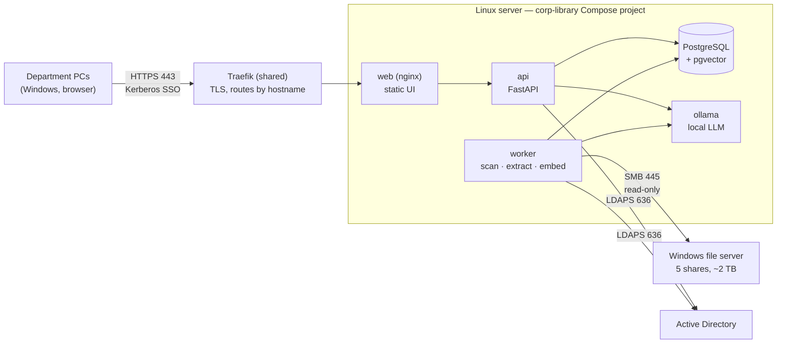

# Corp Library — Roadmap

_Last updated: 2026-10-06 (phase 0 implemented)_

Corp Library is an internal web app that helps our department (~15 people) find documents on the
department shares and decide where new documents belong. It indexes the 5 top-level shares on the
Windows file server (~2 TB), shows each user only what Windows already lets them open, and adds a
local AI assistant that never sends data outside the network.

IT requirements and their justification live in a separate shareable doc:
**Corp Library — IT Requirements** (link it here once shared with IT).

---

## Decisions so far

| Topic | Decision | Why |
| --- | --- | --- |
| Hosting | Docker Compose on the department Linux server | Same as our other webapps; auto-start, easy redeploys |
| Backend | Python + FastAPI | Best ecosystem for text extraction, embeddings and local LLMs |
| Frontend | React + Vite + Tailwind (from v0.1) | Already scaffolded |
| Database | PostgreSQL + pgvector | Concurrency, full-text search and vector search in one place |
| Sign-in | Kerberos SSO, with an LDAP login form as fallback | People won't use an app that asks for a password every day |
| Permissions | Mirror the real NTFS ACLs from the file server, matched by SID | Windows stays the single source of truth; nothing to maintain twice |
| File access | **Read-only.** The app advises; users save files themselves | Safest scope and easiest for IT to approve |
| AI | Local only: Ollama + an open model (Qwen class), `bge-m3` embeddings | Documents contain personal data; English and Spanish both supported |
| GPU | Not guaranteed. Everything except the assistant must work well on CPU | Search delivers most of the daily value |
| HTTPS & hostnames | Shared **Traefik** reverse proxy (separate `traefik-proxy` project) on 443; one hostname per app via DNS **A records**; internal-CA certificate, ideally wildcard | Several apps share the server; Kerberos needs a distinct hostname per app; TLS managed in one place |
| Maintenance | One maintainer | Keep it to a single codebase and few containers; no microservices |

## Guiding principles

1. **Fail closed.** If we can't establish that a user may see a file, they don't see it.
2. **Filter before the AI.** Retrieval is permission-filtered before any text reaches the model.
3. **Windows is the source of truth** for permissions; the app never grants access of its own.
4. **Search must stand on its own.** The assistant is an extra and degrades gracefully without a GPU.
5. **Boring to operate.** One `docker compose up -d`, health checks, backups, logs. Nothing clever.

---

## Target architecture

| Container | Role |
| --- | --- |
| `web` | nginx: serves the built React app, proxies `/api` to FastAPI. Reached only through the shared Traefik proxy, which terminates TLS |
| `api` | FastAPI: auth, search, document streaming, assistant chat, admin |
| `worker` | Same codebase, different entrypoint: scans, text extraction, embeddings, reports. Job queue in Postgres (no broker) |
| `db` | PostgreSQL 16+ with `pgvector`; full-text search via `tsvector` (English + Spanish, `unaccent`) |
| `ollama` | Local LLM and embedding model; optional GPU passthrough |

### How permissions work

1. The worker reads each folder's security descriptor over SMB. With 5 shares granted per user and
   inheritance, most of the work is the top-level folders, but **any subfolder that breaks inheritance
   gets its own ACL**, and the scanner flags it.
2. ACL entries are stored as SIDs (allow and deny) per folder. Each file points to its nearest folder
   with an explicit ACL.
3. At sign-in we resolve the user's SID plus all group SIDs via `tokenGroups` (nested groups included)
   and cache them in the session.
4. Every query (search, browse, assistant retrieval) joins against the ACL mirror. An empty or unknown
   ACL means **no access**.
5. Open/download streams the file through the app after re-checking access. Every access is audit-logged.

### How sign-in works

1. The browser hits `/api/auth/sso`; the API replies `401 WWW-Authenticate: Negotiate`.
2. The browser sends a Kerberos ticket (needs the SPN, keytab, intranet-zone GPO from IT).
3. The API validates it with the keytab (`gssapi`), looks up groups over LDAP, and issues an
   **HttpOnly, Secure session cookie** (sliding expiry, e.g. 30 days).
4. If SSO fails, the user sees the LDAP login form with the same result.

---

## Phases

Each phase ends with something people can use or a decision they can make.

### Phase 0 — Foundations and discovery

_Goal: a full inventory of the shares, to feed the folder-plan discussions. No end-user UI yet._

- [x] Replace SQLite with PostgreSQL; add Alembic migrations (drop `create_all`)
- [x] New Compose stack for Linux: `db`, `api`, `worker`, `web`, `backup` (+ volumes, health checks, `.env`)
- [x] SMB scanner using `smbprotocol`: walk the shares, record path, size, mtime; per-folder
      reconciliation so a transient error never wipes data
- [x] Read folder ACLs (own security-descriptor parser); resolve SIDs to users/groups via LDAP,
      expand nested groups; flag explicit ACLs, broken inheritance, unreadable ACLs
- [x] Incremental rescans (only changed files are updated); nightly schedule; Postgres job queue
- [x] Admin console + reports: inventory by share/type/age, duplicates (size → quick hash → full
      hash), stale folders, hygiene (long paths, deep and empty folders), user × folder permission
      grid, permission exceptions. All export to CSV
- [x] Backups: nightly `pg_dump` to a mounted location
- [ ] First real scan on the file server (needs the IT items below)

**Exit:** a full scan completes, and the reports have been used in a folder-plan meeting.
**Blocked by IT:** scanner account, LDAP access, firewall rules.

Notes from implementation:
- Permissions are read per **folder**. Files are assumed to inherit from their folder, which is
  the norm; reading every file's ACL would double the SMB round-trips. Revisit if the exceptions
  report suggests files with their own permissions.
- Folder owners are recorded; file owners are not (same cost reason).
- v0.1's catalog/search pages were removed; search is rebuilt on the new schema in phase 1.

### Phase 1 — Search MVP with SSO

_Goal: everyone uses it daily to find documents._

- [ ] Kerberos SSO + LDAP fallback + HttpOnly session cookies (replace JWT in `localStorage`)
- [ ] Group resolution via `tokenGroups`; SID-based permission filter on every query
- [ ] Text extraction for Office/PDF/text (Docling or Tika); OCR for scanned PDFs (Tesseract, `spa+eng`).
      Other types (images, video, CAD, archives) are indexed by name, path and metadata only
- [ ] Postgres full-text search: title, path, content; filters by share, type, date; highlighted snippets
- [ ] Browse the share tree (permission-filtered)
- [ ] Document page: metadata, preview where possible, download (re-checked), **"copy network path"**
      button (browsers block `file://` links from HTTPS pages)
- [ ] Audit log of searches, opens and downloads
- [x] Shared Traefik proxy (`traefik-proxy` project) routing `APP_HOST` to the app
- [ ] Internal CA certificate installed in traefik-proxy

**Exit:** all 15 users signed in by SSO; search results match what each person can open in Explorer
(verified with at least 3 users with different access).
**Blocked by IT:** SPN + keytab, DNS A record, intranet-zone GPO, proxy bypass, certificate.

### Phase 2 — Folder plan in the app

_Goal: the agreed structure becomes data the app (and later the assistant) uses._

- [ ] Folder-plan model: path, purpose, owner, what belongs/doesn't, naming convention, examples,
      keywords (EN + ES)
- [ ] Admin editor + read-only "folder guide" for everyone
- [ ] Compliance report: files outside the plan, naming violations, empty or overgrown folders
- [ ] Track the refactor's progress over time (per share)

**Exit:** the department's folder plan is complete in the app and used as the reference during the
refactor.

### Phase 3 — Local AI assistant

_Goal: "find me…" and "where should I save this?" answered in plain English or Spanish._

- [ ] `ollama` container; model chosen by hardware (CPU: ~4–8B quantized; GPU 16 GB: up to ~14B)
- [ ] Embeddings with `bge-m3` in the worker; chunks stored in pgvector
- [ ] Hybrid search: full-text + vectors merged with reciprocal rank fusion; also improves normal search
- [ ] Chat with a small fixed set of tools: `search_documents` (permission-filtered),
      `get_folder_plan`, `suggest_destination`. No general file access
- [ ] "Where should I save this?": the user drops a file, which is analysed in memory and **not stored**.
      The assistant suggests a folder from the plan plus a file name following the naming convention,
      with its reasoning
- [ ] Answers cite the documents they used, linking to the document page
- [ ] Graceful degradation: no LLM available → search plus rule-based suggestions from plan keywords
- [ ] Small evaluation set (~30 real questions EN/ES with expected answers) to compare models and prompts

**Exit:** the assistant answers the evaluation set acceptably; a permission test confirms it never
cites a document the asking user can't open.

### Phase 4 — Nice to have

- Usage stats (top searches, searches with no results → missing docs or bad naming)
- Saved searches / favourites
- Stale-document nudges to folder owners
- Optional write support (save to the suggested folder) — only if the department wants it, and as
  a separate IT discussion

---

## What happens to v0.1

| Area | v0.1 | Plan |
| --- | --- | --- |
| FastAPI app layout, routers, `config.py` | ✔ | **Keep** |
| React + Vite + Tailwind shell, pages, `api.ts` | ✔ | **Keep**, adapt to cookie auth |
| `ldap3` client | Simple bind + `memberOf` | **Rework**: `tokenGroups`, SIDs, LDAPS; keep as SSO fallback |
| Auth | JWT (8 h) stored in `localStorage` | **Rework**: SSO + HttpOnly session cookie |
| `DocumentPermission` (AD group names) | Fail-open: no rows = public | **Replace** with SID-based ACL mirror per folder, fail-closed |
| `ScanConfig.allowed_groups` | Manually set groups per scan root | **Drop**: permissions come from the file server |
| Database | SQLite + FTS5, `create_all` | **Replace**: PostgreSQL + `tsvector` + pgvector, Alembic |
| Scanner | `os.walk` over a mounted path | **Rework**: `smbprotocol`, ACLs, hashes, incremental |
| `Category` (auto-generated from folders) | Mixed tree + curated metadata | **Split**: the folder tree mirrors the shares; curated info moves to the folder plan (phase 2) |
| `DEV_MODE` local admin with password | ✔ | **Rework**: dev-only fake identity (no passwords), impossible to enable in production |
| `passlib`/bcrypt | For dev passwords | **Drop** |
| nginx frontend container | ✔ | **Keep**; TLS handled by the shared Traefik proxy |

---

## Risks

| Risk | Impact | Mitigation |
| --- | --- | --- |
| IT is slow on SSO items | Login friction at launch | LDAP form + 30-day sliding session; SSO switched on later without UI changes |
| No GPU | Slow assistant | CPU-sized model, short answers, search-first UX; GPU request justified in the IT doc |
| Initial scan of 2 TB over SMB is slow | Phase 0 takes longer | Metadata first, content extraction second; incremental afterwards; skip bulk media content |
| ACL edge cases (deny entries, broken inheritance) | Wrong visibility | Fail closed; flag explicit ACLs; test with real users with different access |
| Refactor moves thousands of files | Index churn, broken references | Incremental rescans by path + hash; treat moves as moves, not delete + add |
| Single maintainer | Bus factor | Keep the stack small; deploy/restore documented in `docs/DEPLOYMENT.md` |
| ACLs use local groups of the file server | Those SIDs can't be resolved via LDAP, so access can't be computed | Shown as "unresolved" in the reports; ask IT to use domain groups in the new structure |
| A file has stricter permissions than its folder | It would be visible to everyone who can open the folder | Phase 1: re-check access on open/download; add file-level ACL scanning if needed |

## Open questions

- [ ] Are share permissions granted to individual users or to AD groups? (Asking IT; the app handles both.)
- [ ] Final hostname for the app.
- [ ] Do PCs route intranet traffic through the corporate web proxy?
- [ ] GPU: ask now or after phase 1?
- [ ] Which file types matter most for content extraction (Office, PDF, scanned PDFs, others)?
